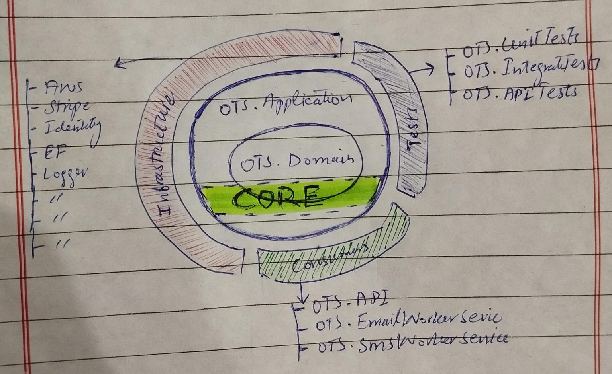

# OTS - A Monolith system with Onion Architecture

## Product Overview

The Online Ticketing System is designed to automate the process of ticket booking for events, travel, and other occasions. The system will allow users to search for events, view available seats, and book tickets online. The objective is to provide a user-friendly and efficient platform that simplifies ticket purchasing and management for both users and administrators.

## Why we chose a Monolithic-Architecture for this Design?
Before designing any system, I always adhere to the YAGNI principle (You Aren't Gonna Need It). Based on our discussion during the first interview call and after reviewing the SRS document, it appears that the app is in its early stages and does not require handling millions of users.

Given these points, I decided not to over-engineer the solution by introducing microservices upfront. Instead, I opted for a monolithic architecture to keep the design simple and efficient.

## Structural Architecture Overview: 
I used basic minimum version of Onion. Just to support this kind of small app. It can easily help me addresses structural concerns within the application codebase, focusing on maintainability, testability, and flexibility.



#### Code Structure:

```txt
root
└─ pipeline  
└─ resources  
└─ tests
	│
	└─ OTS.UnitTests
	└─ OTS.IntegrationTests
└─ src
	│   
	└─ consumers
		│  └─ OTS.API
		│  └─ OTS.EmailWorkerService
		│  └─ OTS.SmsWorkerService	
	└─ core
		│  └─ OTS.Application
		│  └─ OTS.Domain
	└─ OTS.Infrastructure
	└─ [OTS_Onion.sln]
	
```

#### What we achieved using it?

- **Layered Structure:** 
	We have multiple layers like Domain, Application, Infrastructure, and Presentation.
- **Dependency Inversion:** 
	Inner layers do not depend on outer layers. instead, dependencies point inward.
- **Separation of Concerns:** 
	Each layer has a specific responsibility, promoting a clean separation of concerns.

## High Level Design - System Architecture 


## Low level Design - ERD


